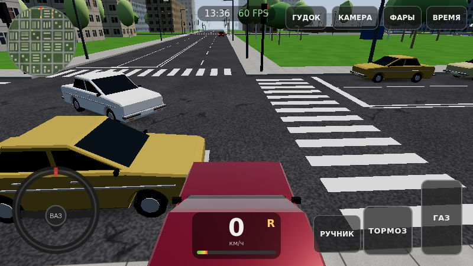
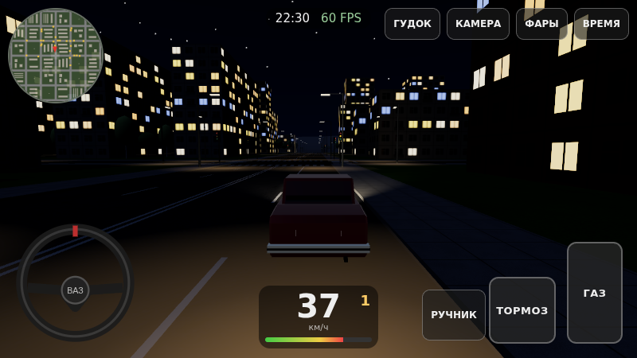
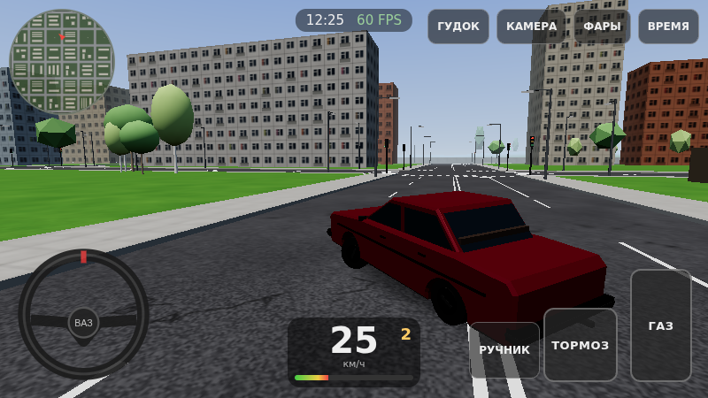

# ВАЗ-2107: симулятор вождения для Android (WebView)

Мобильный 3D-симулятор вождения «семёрки» по панельному городу в духе Автозаводского района. Игра работает в браузере и в нативном Android-приложении, где страница открывается в полноэкранном WebView.

- **Движок:** Three.js r170 (WebGL 2) + Vite. Физика, ИИ и звук написаны с нуля, без тяжёлых зависимостей.
- **Упаковка:** Android-приложение на Kotlin с WebView и `WebViewAssetLoader`. Debug-APK весит **2,4 МБ**.
- **Ассеты:** не используются. Модели, текстуры и звук генерируются процедурно при запуске.

| День, трафик | Ночь | Занос на ручнике |
|---|---|---|
|  |  |  |

## Почему Three.js + WebView

| Критерий | Решение |
|---|---|
| Требование «на WebView» | Нативный движок (Unity/Godot) внутри WebView не запустить, поэтому нужен WebGL-движок. |
| Three.js vs Babylon.js vs PlayCanvas | У Three.js самый маленький рантайм: 130 КБ gzip против ~1 МБ у Babylon. Он даёт прямой контроль над draw calls, InstancedMesh, шейдерами и шейдерными чанками, и его не надо «раздевать». |
| Физика | Готовые движки (Ammo, Rapier) — это +1–2 МБ WASM и лишняя нагрузка на CPU. Для машины хватает своей 2D-модели шин с фиксированным шагом 120 Гц. |
| Размер APK | 2,4 МБ. Звук и текстуры процедурные. |

## Быстрый старт

```bash
cd autovaz-sim
npm install
npm run dev            # http://localhost:5173, с телефона — по IP из той же сети
npm run build          # сборка в dist/
```

Параметры URL для отладки: `?q=low|medium|high` (качество), `?t=22.5` (время суток), `?traffic=0` (без трафика), `?autostart`.

### Сборка APK

```bash
cd autovaz-sim
npm run build                        # dist/ → копируется в APK автоматически (задача copyWebAssets)
cd android
gradle wrapper --gradle-version 8.9  # один раз; или откройте android/ в Android Studio
./gradlew assembleDebug              # → app/build/outputs/apk/debug/app-debug.apk
adb install -r app/build/outputs/apk/debug/app-debug.apk
```

Для отладки на телефоне откройте `chrome://inspect` на ПК: в debug-сборке включён `setWebContentsDebuggingEnabled`. В консоли `game.stats` показывает FPS, draw calls, треугольники и число видимых кварталов.

## Структура проекта

```
autovaz-sim/
├── index.html                 # canvas + DOM-HUD + сенсорные контролы + стартовое меню
├── vite.config.js             # base './', отдельный чанк three.js
├── scripts/                   # copy-basis (транскодер KTX2), check-dist
├── src/
│   ├── main.js                # загрузка, меню (цвет кузова, качество), старт
│   ├── Game.js                # корень игры: рендерер, сцена, игровой цикл (_tick/_frame)
│   ├── config/quality.js      # пресеты low/medium/high + автоопределение GPU
│   ├── core/
│   │   ├── Input.js           # виртуальный руль, педали, кнопки (Pointer Events, multi-touch), клавиатура
│   │   ├── AudioManager.js    # процедурный WebAudio: мотор, визг шин, гудок, удары
│   │   ├── CollisionWorld.js  # 2D spatial hash: AABB/окружности, отрезок-AABB для камеры
│   │   └── Pool.js            # object pool
│   ├── world/
│   │   ├── RoadGraph.js       # параметры сетки, граф перекрёстков для ИИ
│   │   ├── City.js            # асфальт, разметка, кварталы-чанки, фонари, забор, рельеф, occlusion culling
│   │   ├── TrafficLights.js   # светофоры (фазы по ПДД РФ), лампы одним InstancedMesh
│   │   ├── DayNight.js        # солнце/луна, небо-шейдер, звёзды, туман, тени за игроком
│   │   ├── Trees.js           # деревья: InstancedMesh, 2 уровня LOD
│   │   └── Textures.js        # процедурные текстуры + загрузчик KTX2
│   ├── vehicles/
│   │   ├── LadaModel.js       # процедурная модель ВАЗ-2107 (игрок + геометрии трафика LOD0/LOD1)
│   │   ├── VehiclePhysics.js  # физика: шины, перенос веса, задний привод, КПП, ручник
│   │   ├── PlayerCar.js       # физика + визуал + фары + столкновения
│   │   └── SkidMarks.js       # следы шин (кольцевой буфер)
│   ├── traffic/
│   │   ├── TrafficCar.js      # ИИ одной машины (полосы, IDM, светофоры, перестроения, уступка)
│   │   └── TrafficManager.js  # пул, спавн/деспавн вокруг игрока, инстанс-рендер
│   ├── camera/CameraRig.js    # сзади / сзади далеко / капот / салон
│   ├── ui/HUD.js, style.css   # спидометр, тахометр, передача, часы, миникарта
│   └── perf/PerfMonitor.js    # динамическое разрешение
└── android/                   # Gradle-проект оболочки (Kotlin, WebViewAssetLoader)
    └── app/src/main/java/ru/autovaz/sim/MainActivity.kt
```

### Иерархия сцены

```
Scene
├─ Sky (шейдерная сфера), Stars (Points)          — следуют за камерой
├─ HemisphereLight, SunMoonLight (+target)         — один направленный свет днём и ночью
├─ World
│  ├─ Asphalt, Terrain, Markings, Sidewalks, Lawns, Fence
│  ├─ Block_0 … Block_35                           — здания квартала слиты в 1 меш (чанк)
│  └─ StreetLightPoles, StreetLampHeads, StreetLightPools
├─ TrafficLightPoles, TrafficLamps (Instanced)
├─ TreeTrunksLOD0, TreeCrownsLOD0, TreeCrownsLOD1 (Instanced)
├─ TrafficBodyLOD0, TrafficDetailLOD0, TrafficLOD1, TrafficHeadLamps,
│  TrafficTailLamps, TrafficBeams, TrafficBlobShadows (Instanced)
├─ PlayerCar
│  ├─ Body: paint, chrome, glass, rubber, grille, headLamp, tailLamp, … (слиты по материалам)
│  ├─ 4 × wheel pivot → spin → шина, колпак
│  └─ SpotLight фар + target, пятно света фар
└─ SkidMarks
```

## Реализованные системы

### 1. ВАЗ-2107 и физика
- **Модель** (`LadaModel.js`). Боковой профиль кузова и кабины выдавлен по ширине, в профиле вырезаны колёсные арки. Габариты реальные: 4145×1620×1435 мм, база 2424 мм, колёса R13. Есть хромированные бамперы и молдинги, решётка с вертикальными прутьями, прямоугольные фары, номер «В 107 АЗ 63», салон с рулём. Детали слиты по материалам: около 10 draw calls на машину игрока. 10 заводских цветов («Вишня», «Мурена», «Балтика», «Коррида»…).
- **Физика** (`VehiclePhysics.js`):
  - фиксированный шаг 1/120 с;
  - шинная модель `Fy = −μN·tanh(k·α)`, продольный перенос веса;
  - кривая момента 104 Н·м @ 3400 и реальные передаточные числа (3.67/2.10/1.36/1.00/0.82, главная пара 3.9);
  - автомат, у которого пороги переключения зависят от педали газа;
  - задний привод с кругом трения: резкий газ даёт пробуксовку и занос;
  - ручник блокирует задние колёса — получается управляемый дрифт;
  - угол поворота колёс ограничивается скоростью (≈ предел сцепления) — это важно для сенсорного руля;
  - помощник стабилизации;
  - задняя передача: зажать тормоз на месте.
- **Проверено в симуляции:** разгон 0–100 км/ч за ≈17,5 с (у настоящей 2107 ≈17 с). На 3-й передаче машина разгоняется до 104 км/ч. Удар о забор на 104 км/ч отскакивает корректно.

### 2. Освещение
- **Цикл дня и ночи** (`DayNight.js`). Сутки длятся 15 минут. Небо, туман и полусферический свет интерполируются по высоте солнца. Ночью тот же `DirectionalLight` работает как луна, поэтому тени есть и ночью, а лишнего источника в шейдерах нет.
- **Тени.** Shadow map есть только в пресетах medium/high. Ортокамера теней охватывает ±40–55 м вокруг игрока и привязана к сетке текселей, поэтому тени не дрожат. Карта перерисовывается через кадр (`shadowUpdateEvery`), а на low её заменяют blob-тени.
- **Фары игрока.** Обе фары светят одним `SpotLight`: каждый источник света удорожает шейдер всех материалов. Свет всегда в сцене, днём `intensity=0`, поэтому шейдеры не перекомпилируются. К этому добавлено additive-пятно света на дороге, эмиссия стёкол фар, стоп-сигналы при торможении и фонарь заднего хода.
- **Трафик и город ночью.** Фары и фонари машин — излучающие квадраты с пятнами на асфальте, без настоящих источников света. У домов окна светятся по emissive-карте. Фонари дают additive-пятна (fake lighting).

### 3. Текстуры и материалы
- Все текстуры — POT 256–512 px, с mipmaps и настраиваемой анизотропией. Всего 12 текстур и около 6 МБ видеопамяти.
- **Фасад** — атлас 512² (8×8 окон, 24×24 м) с картой свечения окон. Крыши и гаражи берут UV с «глухой панели» того же атласа: один материал на все здания, оттенок задаётся вертексным цветом.
- **Кузов:** `MeshStandardMaterial` с маленьким PMREM-окружением, которое генерируется один раз. Материалы: краска (metalness 0.45), хром, тонированное стекло (прозрачное на medium/high), резина.
- **Мир:** `MeshLambertMaterial`, он дешевле PBR на мобильных GPU.
- **Сжатие.** Для реальных ассетов есть `loadCompressedTexture()`: KTX2/Basis транскодируется в ETC2/ASTC и остаётся сжатым на GPU (в 4–8 раз меньше памяти). Команды: `npm run copy-basis` и `toktx --t2 --encode etc1s --genmipmap out.ktx2 in.png`.

### 4. Карта
- Сетка 7×7 перекрёстков (6×6 кварталов, 600×600 м). Дороги по 2 полосы в каждую сторону.
- Разметка по ПДД РФ: двойная сплошная, прерывистая, сплошная перед стоп-линией, стоп-линии, «зебры».
- Типы кварталов: хрущёвки и девятиэтажки, 12–16-этажные точечные дома, гаражный кооператив с пятиэтажкой, парк с киоском «Союзпечать».
- Вокруг города — бетонный забор ПО-2, холмистый рельеф (fbm-шум) и лесополосы.
- Покрытие влияет на сцепление: асфальт μ=1.0, тротуар 0.95, газон 0.62.

### 5. Трафик и ИИ (`TrafficCar.js`, `TrafficManager.js`)
- Машины едут по полосам, а через перекрёсток — по кривым Безье.
- Перед поворотом машина заранее перестраивается: направо — в правую полосу, налево — в левую.
- **IDM** (Intelligent Driver Model) обеспечивает плавное следование за лидером: другой машиной, игроком или стоп-линией на красный.
- **Светофоры:**
  - на красный машина стоит;
  - на жёлтый останавливается, только если успевает затормозить с замедлением ≤3.5 м/с²;
  - перед зелёным загорается «красный + жёлтый», в конце зелёного он мигает.
- **Левый поворот** уступает встречным. Если встречная машина тоже поворачивает налево, приоритет получает та, у которой меньше id, поэтому дедлоков нет.
- **Объезд препятствий:** если машина стоит за неподвижным препятствием дольше 2 с, она перестраивается, когда соседняя полоса свободна.
- Если игрок перегородил дорогу, машины сигналят (гудок со стереопанорамой).
- При столкновении с игроком машина останавливается («оглушается»).
- **Проверено:** 60 с симуляции с 18 машинами — пересечений машин 0, NaN нет, на светофорах одновременно стоит 5–10 машин.

### Управление, камера, звук
- **Управление.** Слева виртуальный руль ±150° с самовозвратом, справа педали газа и тормоза. Отдельные кнопки: ручник, гудок, камера, фары (авто/вкл/выкл), время суток. Multi-touch работает через Pointer Events и `setPointerCapture`. При ударе срабатывает вибрация.
- **Камера.** Режимы: «сзади» и «сзади (далеко)» — с инерцией и защитой от ухода за стену (отрезок до камеры проверяется против AABB зданий). Ещё два режима — «капот» и «из салона» (водитель слева). FOV растёт со скоростью, при ударе камера трясётся.
- **Звук** на WebAudio, без файлов:
  - мотор — три осциллятора на частоте вспышек 4-цилиндрового двигателя (об/мин/60·2) и шум через фильтр, завязанный на нагрузку;
  - визг шин — полосовой шум в зависимости от скольжения;
  - ветер;
  - двухтональный гудок;
  - удары — шумовой всплеск и низкий «бум».

## Оптимизация под мобильные устройства

| Техника | Где | Эффект |
|---|---|---|
| Слияние статики (merge) | `City.js`: разметка, тротуары, газоны, столбы и забор — по одному мешу; здания квартала — один чанк | Статика — 9 мешей + по одному на видимый квартал |
| InstancedMesh | трафик (7 мешей на весь поток), деревья (3), лампы светофоров (1) | Число draw calls не зависит от количества объектов |
| LOD | трафик: LOD0 ≈1.2k треуг. → LOD1 ≈150 (дистанция зависит от пресета); деревья: 100 → 20 треуг. → не рисуются | −60–80 % треугольников вдали |
| Occlusion culling | `City._occluded()`: квартал скрывается, если все 9 лучей от камеры к его контуру перекрыты зданиями не ниже его самого высокого дома (2D slab-тесты, раз в 8 кадров) | Замер в 6 точках города: дополнительно к distance culling скрывает 8–38 % кварталов (в среднем ≈20 %) |
| Distance culling + туман | чанки, деревья, трафик; `camera.far` = дальности прорисовки | Нет дальних полигонов, горизонт скрыт туманом |
| Object pooling | `Pool.js` для машин; кольцевые буферы для следов шин | Нет аллокаций в цикле и пауз GC |
| Динамическое разрешение | `PerfMonitor.js`: pixelRatio 0.5–2.0 при FPS < 28 / > 56 | Главный рычаг против нехватки fill rate |
| Дешёвые тени | shadow map только вокруг игрока, со снапом, обновление через кадр; на low — blob-тени | Меньше проходов рендера |
| Дешёвый свет | 1 SpotLight на игрока, остальное — emissive и additive-декали; число источников постоянно | Нет перекомпиляции шейдеров, короткие шейдеры |
| Материалы | Lambert для мира, Standard только для машины игрока | Меньше ALU на фрагмент |
| Прогрев шейдеров | `renderer.compile()` перед стартом | Нет фризов в первые секунды |
| `matrixAutoUpdate=false` | вся статика | Меньше работы CPU на обход сцены |
| Фиксированный шаг физики с лимитом 12 шагов | `VehiclePhysics.update` | Нет «спирали смерти» на слабых CPU |
| HUD в DOM, 10 Гц | `HUD.js` | UI не нагружает GPU |
| Жизненный цикл | `onPause`/`onResume` в Activity → пауза цикла и звука; обработка `webglcontextlost` | Батарея, стабильность |

**Замер** (medium, 960×540): 42–56 draw calls, ≈120 тыс. треугольников, 12 текстур.

### Пресеты качества (`config/quality.js`)

| | low | medium | high |
|---|---|---|---|
| Разрешение (× CSS px) | 0.75 (0.5–1.0) | 1.0 (0.6–1.25) | 1.5 (0.8–2.0) |
| Тени | blob | 1024², через кадр | 2048², PCF Soft |
| Машин трафика | 10 | 18 | 28 |
| Дальность прорисовки | 220 м | 320 м | 450 м |
| Отражения и прозрачное стекло | — | ✓ | ✓ |
| Пятна света от фонарей | — | ✓ | ✓ |

Пресет выбирается автоматически по GPU (Mali/Adreno/PowerVR), числу ядер и `deviceMemory`, а в меню его можно переключить вручную.

## Что дальше
- Вторая модель (Нива 2121, Гранта) через тот же конвейер `buildParts()`: профиль → выдавливание → слияние.
- Пешеходы на «зебрах» (тот же подход: граф + пул + инстансинг).
- Ручная КПП и приборная панель «семёрки» в виде салона.
- Деформация кузова при ударах (смещение вершин в зоне контакта).
