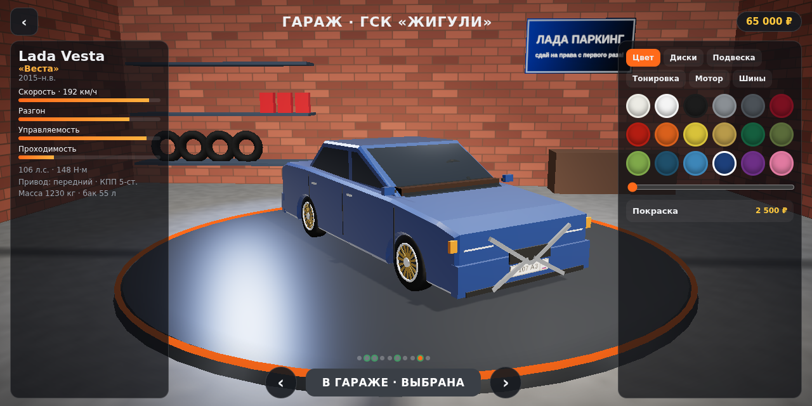
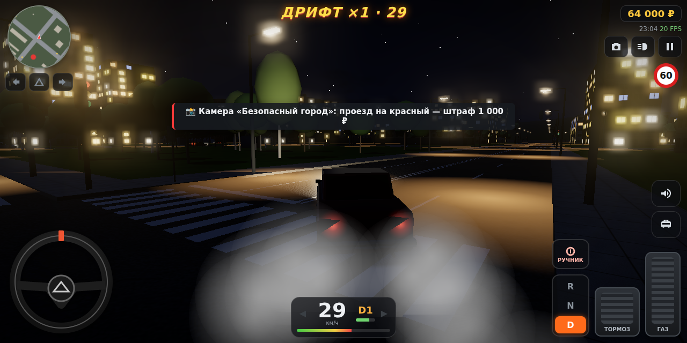
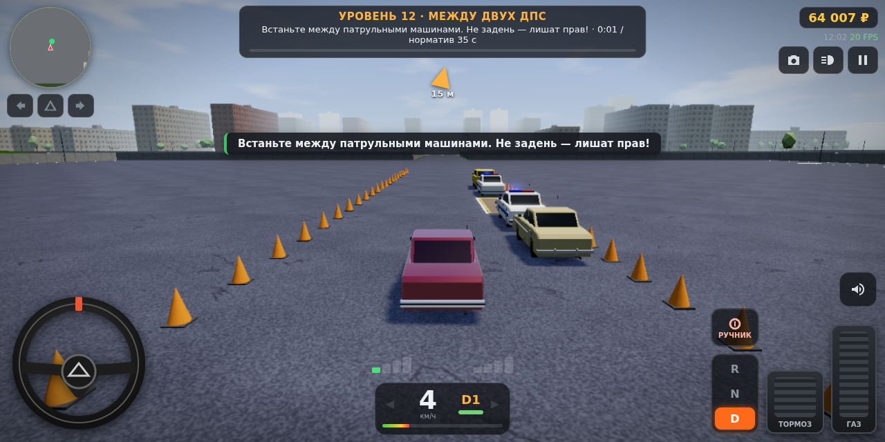
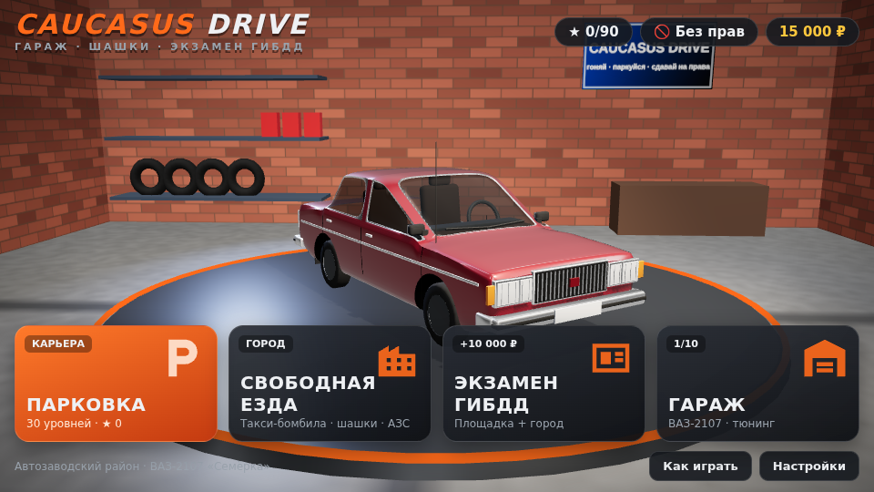
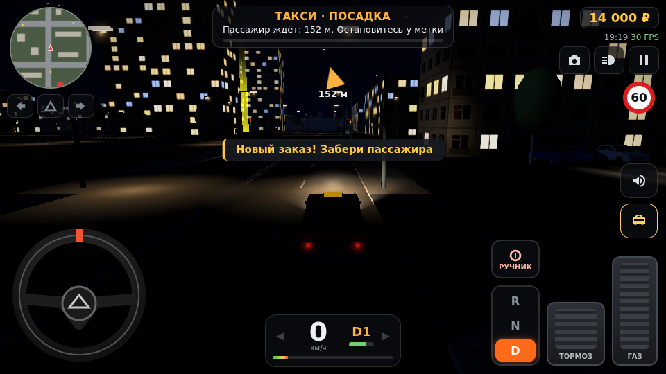
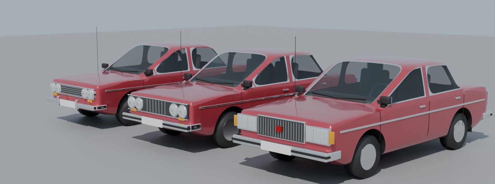
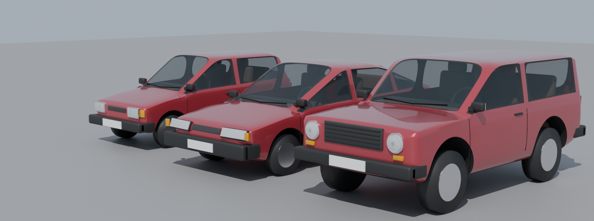
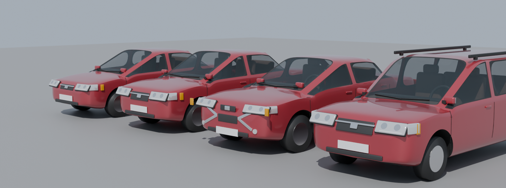

# CAUCASUS DRIVE: гараж, шашки, экзамен ГИБДД

Мобильная 3D‑игра в духе Car Parking про автомобили АвтоВАЗ, со своей изюминкой: российский двор, ГСК «Жигули», экзамен ГИБДД с инструктором, такси‑бомбила, камеры «Стрелка», посты ДПС и «шашки» по городу.

- **Движок:** Three.js r170 (WebGL 2) + Vite. Физика, ИИ трафика, звук и все модели написаны с нуля.
- **Платформа:** Android — нативная обёртка на Kotlin с WebView (`WebViewAssetLoader`); также работает в браузере.
- **Размер:** APK ≈ 3,9 МБ. Машины — модели из Blender (GLB + Draco); текстуры и звук генерируются процедурно.

| Гараж и тюнинг | Ночной город (bloom) | Парковка «Между двух ДПС» |
|---|---|---|
|  |  |  |

| Главное меню | Такси‑бомбила | Дрифт |
|---|---|---|
|  |  |  |

## Режимы

| Режим | Что делать |
|---|---|
| **Парковка** (карьера) | 30 уровней на автодроме ДОСААФ, 8 типов упражнений: бокс передом и задом, параллельная, гараж передом и задом, змейка, «ёлочка» 45°, лабиринт из конусов, разворот в тупике, «Между двух ДПС». Любое касание — провал. Звёзды даются за время относительно норматива, рубли — за звёзды; за первое прохождение награда ×2. |
| **Свободная езда** | Город 600×600 м с трафиком. **Такси‑бомбила**: пассажиры с репликами, тариф за расстояние, рейтинг снижается за удары. **АЗС** с заправкой, **камеры «Стрелка»** и **посты ДПС** выписывают штрафы. **Шашки**: обгоны впритирку на скорости выше 60 км/ч и дрифт дают комбо‑множитель и рубли. |
| **Экзамен ГИБДД** | Площадка (змейка → параллельная → гараж задом), затем маршрут по городу по указаниям инструктора. Штрафные баллы начисляются за красный свет, превышение, двойную сплошную, встречку, поворот без поворотника, тротуар и ДТП. 5 баллов — экзамен не сдан. Сдал — получаешь права и 10 000 ₽. |
| **Гараж** | 10 машин, покупка за рубли. Тюнинг: покраска (18 цветов и слайдер оттенка), 6 видов дисков (штамповка, колпаки «Жигули», «звезда», спорт, «BBS»), занижение и лифт, тонировка, мотор (чип → расточка → турбо «Колхоз»), шины. |

## Машины

| Модель | Привод | Мощность | 0–100 км/ч* | Макс. скорость* | Цена |
|---|---|---|---|---|---|
| ВАЗ‑2101 «Копейка» | задний | 64 л.с. | 19,2 с | 143 км/ч | 25 000 ₽ |
| ВАЗ‑2106 «Шестёрка» | задний | 80 л.с. | 13,5 с | 159 км/ч | 40 000 ₽ |
| ВАЗ‑2107 «Семёрка» | задний | 71 л.с. | 15,7 с | 150 км/ч | стартовая |
| ВАЗ‑1111 «Ока» (2 цилиндра) | передний | 33 л.с. | 24,4 с | 130 км/ч | 15 000 ₽ |
| ВАЗ‑2109 «Девятка» | передний | 70 л.с. | 13,0 с | 155 км/ч | 70 000 ₽ |
| ВАЗ‑2121 «Нива» | полный | 80 л.с. | 19,4 с | 135 км/ч | 90 000 ₽ |
| Lada Priora | передний | 98 л.с. | 10,6 с | 183 км/ч | 140 000 ₽ |
| Lada Granta | передний | 87 л.с. | 12,1 с | 171 км/ч | 180 000 ₽ |
| Lada Largus | передний | 102 л.с. | 12,6 с | 162 км/ч | 260 000 ₽ |
| Lada Vesta | передний | 106 л.с. | 11,6 с | 177 км/ч | 320 000 ₽ |

\* Измерено в симуляции (`VehiclePhysics`), тормозной путь со 100 км/ч — 32–43 м. В трафике также ездят ДПС (2107 с мигалками) и такси (Гранта с шашечками).

## Скачать

- **APK:** GitHub → вкладка **Releases** → «CAUCASUS DRIVE — последняя сборка» → `CaucasusDrive.apk` (пакет `com.caucasusdrive.game`). Собирается автоматически (GitHub Actions, `.github/workflows/caucasus-drive-apk.yml`) при каждом изменении в `caucasus-drive/`; там же лежит `CaucasusDrive-source.zip` с исходниками.
- Тот же APK и исходники доступны в Actions → последний запуск → артефакт `CaucasusDrive`.
- Прогресс из «Лада Паркинг» в браузерной версии подхватывается автоматически. APK ставится как новое приложение (другой пакет), старое можно удалить.

## Модели машин (Blender)





Все 10 машин + ДПС и такси собраны в **Blender 4.2** скриптами из `tools/blender/` по реальным габаритам и форме прототипов. Итог — `public/models/<id>.glb` (Draco, ~120 КБ на машину), в каждом файле три уровня детализации:

| Уровень | Треугольники | Где |
|---|---|---|
| `LOD_hi` | 24–36 тыс. | машина игрока и 3D‑гараж: салон, кресла, руль, рассеиватели фар, молдинги, швы дверей |
| `LOD0` | ~4 тыс. | трафик вблизи |
| `LOD1` | ~1 тыс. | трафик вдали |

Как устроено:
- кузов — каркас из поперечных сечений (как на плазовых чертежах: порог, боковина, линия плеч, линия окон, свод крыши);
- характерные линии задаются жёсткостью рёбер (crease), затем Subdivision Surface;
- колёсные арки вырезаются булевой операцией;
- стёкла утоплены в хромированные или резиновые рамки;
- фары, решётки, бамперы, фонари, зеркала, ручки и салон ставятся точно на поверхность кузова (raycast).

Формы кузовов — `tools/blender/shapes.py`, детали по стилю каждой модели — `details.py`.

Пересобрать модели (нужен Blender 4.2+ в PATH):

```bash
npm run models        # = node tools/blender/export-dims.mjs && blender -b --python tools/blender/build_cars.py -- public/models
blender -b --python tools/blender/preview.py -- out.png vaz2107,niva front34   # рендер-превью (Cycles)
```

Если GLB не найден, игра использует процедурную модель из `CarFactory.js`.

## Запуск

```bash
cd caucasus-drive
npm install
npm run dev        # http://localhost:5173 (с телефона — по IP в той же сети)
npm run build      # сборка в dist/
```

Параметры URL для отладки: `?q=low|medium|high`, `?res=1080` (высота рендера), `?nogov` (выключить регулятор), `?free`, `?level=5`, `?exam`, `?t=22.5` (время суток). Витрина всех моделей: `tools/lineup.html` (запускать через dev‑сервер).

### APK

```bash
cd caucasus-drive && npm run build
cd android
./gradlew assembleDebug               # → app/build/outputs/apk/debug/app-debug.apk (нужны JDK 17 и Android SDK)
```

## Управление

Слева: руль (или стрелки, или наклон телефона — выбирается в настройках). Справа: газ, тормоз, рычаг **R · N · D** (или «+/−» на механике) и ручник. Под миникартой — поворотники и аварийка. Кнопки: гудок, такси, камера (сзади / далеко / сверху / капот / салон), фары. Свайп по экрану — осмотреться вокруг.

Клавиатура: WASD — движение, Пробел — ручник, Q/E — передачи, Z/X/V — поворотники и аварийка, H — гудок, C — камера, L — фары, T — такси, F — действие, Esc — пауза.

## Структура

```
src/
├── main.js                 приложение: меню ↔ режимы, пауза, результаты
├── Game.js                 мир и игровой цикл (tick/render), связка всех систем
├── config/
│   ├── cars.js             10 моделей + ДПС/такси: профили кузова, оптика, характеристики, цены, тюнинг
│   ├── levels.js           генератор 30 парковочных уровней и упражнений экзамена
│   └── quality.js          пресеты low/medium/high (разрешение в физических пикселях) + автоопределение GPU
├── core/                   Input (руль/стрелки/наклон, рычаг), AudioManager (процедурный звук),
│                           CollisionWorld (spatial hash), Save (прогресс), Pool
├── vehicles/
│   ├── CarFactory.js       параметрический генератор машин (кузов, стёкла, оптика, диски, LOD)
│   ├── CarInstancer.js     инстанс‑рендер всех чужих машин (2 LOD на модель)
│   ├── VehiclePhysics.js   физика: шины, перенос веса, RWD/FWD/AWD, КПП, топливо
│   ├── PlayerCar.js        машина игрока: тюнинг, свет, поворотники, дым, коллизии
│   └── SkidMarks.js
├── traffic/                ИИ трафика: полосы, IDM, светофоры, уступка, перестроения, поворотники
├── world/                  City (город, АЗС, ДПС, знаки, автодром), DayNight (небо с облаками),
│                           TrafficLights, Trees, Textures, GarageScene (3D‑гараж меню)
├── gfx/                    GlowPoints (свечение ламп), Smoke, PostFX (bloom), EnvManager, Markers
├── gameplay/               ParkingMode, FreeRideMode, ExamMode, LevelScene, Rules (ПДД)
└── ui/                     HUD, Menus, style.css
android/                    Kotlin‑обёртка (WebView + WebViewAssetLoader)
```

## Графика и оптимизация под мобильные

| Техника | Где | Эффект |
|---|---|---|
| Инстансинг машин | `CarInstancer`: трафик, дворы, препятствия — по 2 draw call на модель; кузов красится через атрибут `paintMask` | Сотня машин ≈ 10–16 draw calls |
| LOD | машины ~1,2k → ~210 треугольников; деревья 100 → 20 | Дальние объекты дешевле |
| Occlusion + distance culling | кварталы‑чанки, 2D‑лучи от камеры | −8…38 % кварталов |
| Свечение без bloom | `GlowPoints`: все лампы, фары, стопы, поворотники, мигалки — 1 draw call | Красивая ночь даже на слабых GPU |
| Bloom | только на «Высоком» и только в темноте; половинное разрешение, буферы с MSAA ×4 | Светятся лампы и фары, небо не «мылится» |
| PBR‑отражения | окружение генерируется из того же неба (`EnvManager`), обновляется раз в 20 игровых минут | Краска и хром отражают закат |
| Лак | `MeshPhysicalMaterial` с clearcoat — только для машины игрока на «Высоком» | — |
| AO у земли | вертексный градиент у основания зданий | Бесплатное затенение |
| Тени | shadow map только вокруг игрока со снапом к текселям; на «Низком» — blob‑тени | — |
| Адаптивный регулятор качества | `PerfMonitor` + `Game.setDegrade` | Держит FPS даже на «Высоком» на слабом телефоне (см. ниже) |
| Пулы, отсутствие аллокаций в цикле | трафик, частицы, следы | Нет пауз GC |

### Чёткость («без мыла»)

- Разрешение рендера задаётся в **физических пикселях** по короткой стороне экрана: «Низкое» — 600, «Среднее» — 800, «Высокое» — 1080 (не выше нативного). Никогда не ниже 1 CSS‑пикселя. Раньше «Низкое» на телефоне с DPR 3 рендерило ~300 строк и растягивало их в 4 раза.
- Аппаратное **MSAA ×4** на всех пресетах (на тайловых GPU Mali/Adreno/PowerVR почти бесплатно), в том числе в буферах постобработки.
- Анизотропная фильтрация ×4 («Низкое») и ×8 — дорога и разметка чёткие под углом.
- Bloom не размывает дневную картинку: он включается только в темноте, с высоким порогом и малым радиусом.

### Регулятор качества для слабых телефонов

Раз в 1,5 с `PerfMonitor` смотрит на FPS. При FPS < 45 он спускается на одну ступень, а при FPS ≥ 56 в течение 4,5 с поднимается обратно. Всё переключается без перекомпиляции шейдеров, поэтому нет рывков.

| Ступень | Что выключается |
|---|---|
| 1 | bloom; тени обновляются через кадр |
| 2 | тени от деревьев и трафика; меньше припаркованных машин вокруг |
| 3 | трафик −35 %, LOD машин и деревьев ближе, облака; тени раз в 3 кадра |
| 4 | карта теней 1024 вместо 2048, обновление раз в 4 кадра |
| 5+ | только теперь разрешение: шаги ×0,88 до минимума пресета |

Если снижение качества не дало прироста (экран ограничен 30 Гц, режим энергосбережения, упор в CPU), регулятор возвращает картинку и не трогает её 20 → 60 → 180 → 300 с. Дешевле стали и материалы: асфальт — Lambert с картой нормалей вместо PBR, облака — 3 октавы шума вместо 4, тени — PCF вместо PCFSoft.

Замер (medium, 960×540): около 70 draw calls и 140 тыс. треугольников в городе с трафиком.

## Проверено

- Физика всех 10 моделей: разгон, максималка и торможение совпадают с паспортными с точностью ±10 %.
- В headless‑Chromium: меню, гараж (покупка и тюнинг меняют физику), город, 6 разных уровней и экзамен работают без ошибок JS. Автотесты подтвердили:
  - успешную парковку (3★ и награду);
  - провал при касании конуса;
  - распознавание «задом наперёд»;
  - переход экзамена с площадки в город;
  - штраф камеры «Стрелка» за 109 км/ч;
  - штраф за проезд на красный;
  - комбо дрифта.
- APK собирается (`assembleDebug`). На реальном устройстве не запускался — FPS и отзывчивость сенсорного управления на телефоне нужно проверить.
